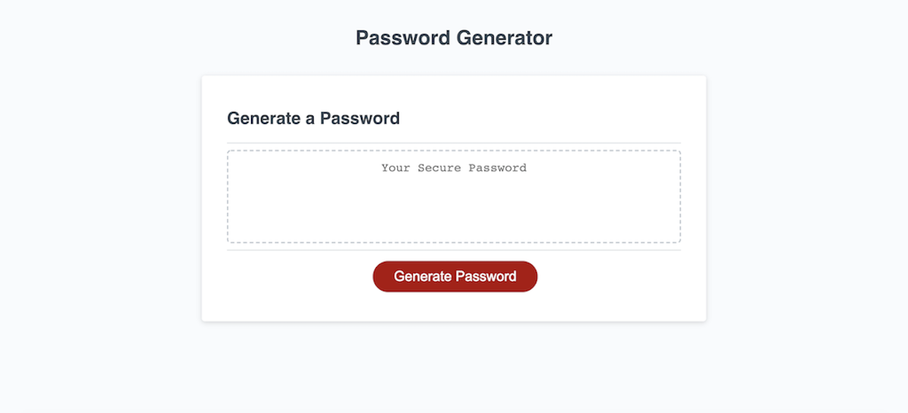
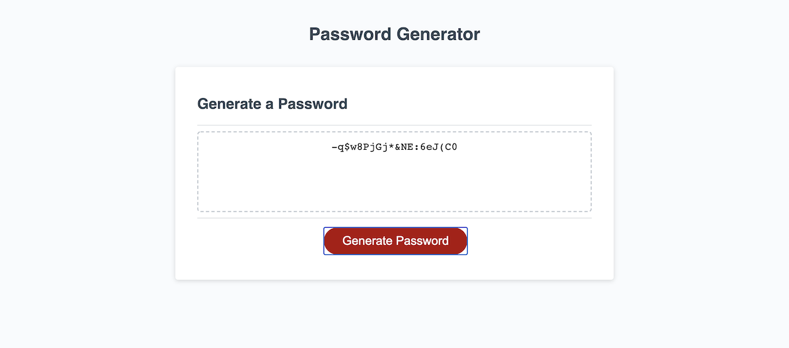

# Password Generator
This application allows the user to select different options from a few different criteria that will then generate a random password for them.

## Criteria
1. User selects specific character length
2. User selects if they want lowercase characters
3. User selects if they want uppercase characters
4. User selects if they want numbers
5. User selects if they want special characters

## How It Works

Link to live site: [Password Generator](https://portercol.github.io/Password-Generator/)

## Credits/Technologies Used
1. TAs/Tutors
2. Peer Groups
3. GOOGLE
4. HTML5
5. Basic CSS
6. JavaScript